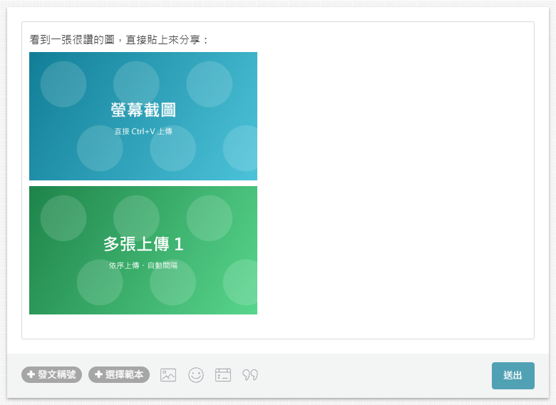
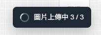
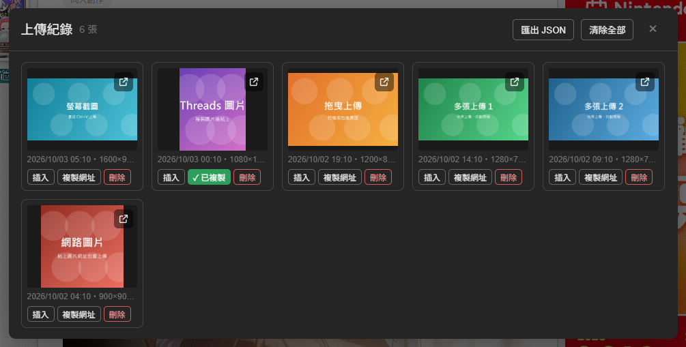

# 巴哈圖片快速上傳

用於巴哈姆特哈啦區（`forum.gamer.com.tw`）的 Tampermonkey userscript。直接在文章編輯器或留言框貼上圖片、或拖曳圖片時，會自動上傳到巴哈圖床並插入編輯框；貼在頁面其他位置則先預覽，確認後才上傳。只有網址或文字時，保留原本的貼上行為。

## 安裝

1. 安裝 [Tampermonkey](https://www.tampermonkey.net/)。
2. [點此安裝 userscript](https://raw.githubusercontent.com/udeyubi/bahamut-image-uploader/main/baha-image-uploader.user.js)。

## 功能

- **全域貼上**：不必先點進編輯框，按 Ctrl+V 會顯示待上傳圖片，可移除圖片或取消，按「確認上傳」才送出。預覽期間再次貼上會追加圖片。直接貼進文章編輯器或可編輯的留言／文字框則立即上傳。
- **圖片與文字分開處理**：截圖或「複製圖片」取得的圖片檔會上傳；只有圖片網址、一般文字或 HTML 時不會自動下載上傳。
- **拖曳上傳**：把圖片拖進頁面時會出現「把圖片拉進來以上傳」的全畫面遮罩，放開即上傳。
- **多張上傳**：一次貼上或拖曳多張會依序上傳，每張間隔 1.5 秒，避免短時間送出太多請求；單張失敗會自動重試一次。
- **上傳紀錄**：每張上傳成功的圖片都會記錄下來，可以再次插入、複製網址或匯出。
- 寬度超過 1920 的圖片會先縮圖（與巴哈內建上傳相同）；BMP、AVIF 等巴哈不收的格式會自動轉成 PNG。

## 使用畫面

> 截圖中的圖片皆為示範用的圖片。

### 拖曳上傳

把圖片檔拖進頁面任何地方，會出現全畫面遮罩，並顯示圖片會插入到哪裡；放開即開始上傳。

### 上傳後自動插入編輯框

貼上或拖曳的圖片上傳完成後，會依序插入文章編輯框（或你最後點過的留言框）。

### 上傳進度

右下角會顯示目前進度，完成後可直接打開上傳紀錄。

　

## 圖片會插到哪裡

1. 最後點過的留言框或輸入框。
2. 否則插到文章編輯框（文章底部的快速回覆、發文頁面）。
3. 頁面上沒有任何編輯框時，上傳後會把網址複製到剪貼簿。

文章編輯框插入 ``（BBCode 模式則插入 `[img=網址]`）；留言框插入圖片網址。

## 上傳紀錄

- **開啟方式**：在巴哈文章頁面右上角的「更多」選單（或往下捲後固定標題列的「⋮」選單）點選「上傳紀錄」；或點上傳完成提示上的「上傳紀錄」按鈕。
- **預覽**：點紀錄裡的圖片會以燈箱放大預覽，點圖片旁邊（或按 Esc）關閉燈箱、回到上傳紀錄。
- **儲存位置**：Tampermonkey 的腳本儲存空間（`GM_setValue`），所有巴哈分頁共用，清除網站 Cookie／快取也不會消失。最多保留最近 1000 筆。
- **每筆紀錄的欄位**：圖片網址、上傳時間、檔案大小、寬高、看板編號、上傳時所在頁面、貼上或拖曳。
- 每張圖可以插入、複製網址、刪除紀錄，縮圖右上角的圖示可在新分頁開啟；也可以匯出全部紀錄成 JSON。刪除紀錄前會先確認，且不會刪除巴哈圖床上的圖片。
- 若想備份或換電腦，可以用「匯出 JSON」，或用 Tampermonkey 本身的備份／同步功能。
- 開啟紀錄、載入更多、預覽、插入、複製、刪除與匯出只接受真實使用者事件，拒絕網頁程式模擬點擊。這不是完整隔離：親自開啟後，已顯示的紀錄仍可被同頁程式讀取。

### 開啟上傳紀錄

### 上傳紀錄面板

縮圖右上角的圖示可在新分頁開啟；複製網址後按鈕會暫時顯示「✓ 已複製」；紅色的「刪除」只會移除紀錄。

### 燈箱預覽

點縮圖放大預覽，點圖片旁邊或按 Esc 回到上傳紀錄。

## 使用提醒

- 必須先登入巴哈姆特才能上傳。
- 從 Excel、Word 複製含文字的內容時會照常貼上文字，不會被當成圖片。
- 想上傳網路圖片，請使用「複製圖片」，確保剪貼簿含圖片檔，或先另存圖片再拖入；單純「複製圖片網址」會保留原本貼上行為。
- 網站改版可能導致上傳 API 或編輯框失效。

## 更新紀錄

### 1.0.8（2026-10-03）

- 在頁面非編輯框位置貼上圖片時先顯示本機預覽，確認後才上傳；支援移除圖片、取消與 Esc 關閉。
- 直接貼入文章編輯器、留言框及拖曳圖片仍立即上傳；判斷以當次貼上位置為準。

### 1.0.7（2026-10-03）

- 上傳紀錄入口與資料操作加入真實事件檢查，阻止網頁程式模擬操作來開啟或匯出紀錄。

### 1.0.6（2026-10-03）

- 移除開啟上傳紀錄的 `Alt + U` 快捷鍵；仍可從選單或上傳完成提示開啟紀錄。

### 1.0.5（2026-10-03）

- 貼上或拖曳時只上傳實際圖片檔；純網址、文字與 HTML 不再觸發圖片下載上傳。
- 移除外部圖片下載與相關連線權限。

### 1.0.4（2026-10-03）

- 修正：上傳成功後先儲存紀錄，插入編輯框失敗不會遺失圖片網址，也不會因此重新上傳。
- 無法插入圖片或儲存紀錄時會複製網址；若剪貼簿操作失敗，提示中會保留網址供手動複製。
- 正確處理編輯框關閉、停用與插入操作失敗的情況。

### 1.0.3（2026-10-03）

- 修正：頁面往下捲後出現的固定標題列，其「⋮」選單裡沒有「上傳紀錄」。現在頁首與固定標題列兩個選單都會加入。

### 1.0.2（2026-10-03）

- 上傳紀錄的「開啟」改成縮圖右上角的圖示（方框加箭頭），點擊在新分頁開啟圖片。
- 「刪除」改為紅色按鈕，刪除前會先確認，並說明只會從紀錄中移除、不會刪除圖片本身。
- 「複製網址」成功後按鈕會變成綠色「✓ 已複製」，2 秒後改回。

### 1.0.1（2026-10-03）

- 「上傳紀錄」入口改為加在文章頁右上角的「更多」選單（與「巴哈黑名單偵測」相同），移除 Tampermonkey 選單項目；`Alt + U` 快捷鍵保留。
- 新增：點上傳紀錄裡的圖片可放大燈箱預覽，點圖片旁邊或按 Esc 回到上傳紀錄。

### 1.0.0（2026-10-03）

- 第一版：全域貼上上傳、拖曳遮罩、多張依序上傳與重試、網路圖片下載後上傳、上傳紀錄。

## 作者

[@udeyubi](https://github.com/udeyubi)
